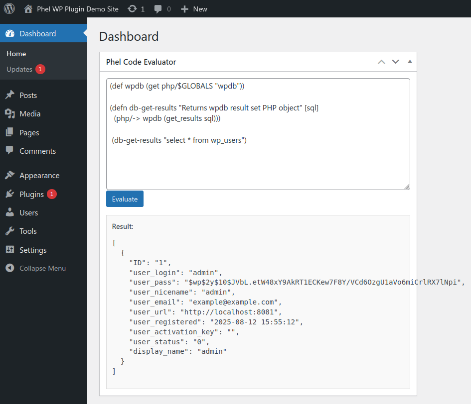

# wp-http-eval

A powerful WordPress plugin that allows administrators to evaluate Phel code via HTTP requests or directly from the WordPress admin dashboard.



## Features

- Widget
  - Admin dashboard widget for convenient code testing
  - Support for Ctrl+Enter shortcut in the dashboard widget
- REST API endpoint for remote Phel code evaluation
  - Secure token-based authentication
  - Automatic HTTPS enforcement for non-local domains

## Security notes

Remote execution of arbitrary code **should only be allowed used in development environments or by trusted administrators in production**. Always use strong, unique tokens and HTTPS in production.

# Installation

## Development container setup

Start a bare bones WordPress installation with the plugin installed and configured with all features by running `docker compose up` in this directory to get a demo running. This requires working Docker (or Podman) installation.

## Installing on existing WordPress site

1. Clone or download this repository to your WordPress plugins directory
2. Run `composer install` to install dependencies
3. Activate the plugin through the WordPress admin panel
4. Configure plugin settings in your `wp-config.php` file
  - Enable the admin dashboard widget `define('WP_HTTP_EVAL_WIDGET', true);`
  - Enable the REST API endpoint `define('WP_HTTP_EVAL_API', true);`
  - Set API token `wp-config.php` with `define('WP_HTTP_EVAL_TOKEN', 'secret123');`

### Composer notes
To populate the `vendor/` path, `composer install` needs to be run first. After this the repository can be placed in `wp-content/plugins/` directory or zip can be created from the repository folder for installing on a site.

There's some ceaveats to the Composer autoloader in plugins as explained in [phel-wp-plugin](https://github.com/jasalt/phel-wp-plugin) readme which need to be considered if the same Composer dependencies are used in separate places (plugins or theme).

# API client examples

Examples are written using the development container setup exposing WordPress installation at http://localhost:8081

## Curl

```
curl -X POST -H "X-WP-HTTP-EVAL-TOKEN: secret123" -H "Content-Type: text/plain" --data "(+ 1 2 3)" http://localhost:8081/wp-json/wp-http-eval/v1/eval

{"success":true,"result":6}
```

Should be only ever be used over https and it's enforced with domains other than localhost and ones ending with `.test`.

Requiring Phel namespaces is possible also:
```
curl -X POST -H "X-WP-HTTP-EVAL-TOKEN: secret123" -H "Content-Type: text/plain" --data "(require phel\html)(html/html [:p \"foo\"])" http://localhost:8081/wp-json/wp-http-eval/v1/eval

{"success":true,"result":"<p>foo<\/p>"}
```

## Phel PHP HTTP client example

With Phel installed either as Phar named `phel` in `PATH` or via Composer where it's callable via `vendor/bin/phel` at the current directory, example HTTP client code is included at `client-example/client.phel` which can be run as follows:

```
WP_HTTP_EVAL_TOKEN=secret123 WP_HTTP_EVAL_HOST=http://localhost:8081 phel run client-example/client.phel

Requesting http://localhost:8081/wp-json/wp-http-eval/v1/eval
Response: {"success":true,"result":"<h1>Requested WP backend at 8de8a50072c7<\/h1>"}
```
